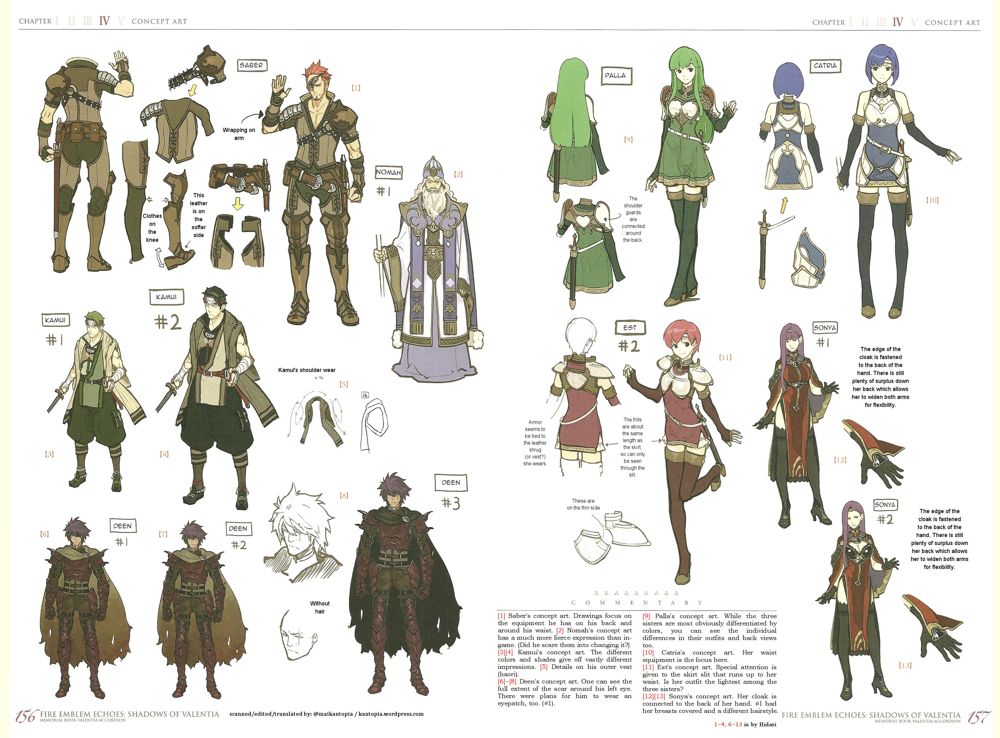
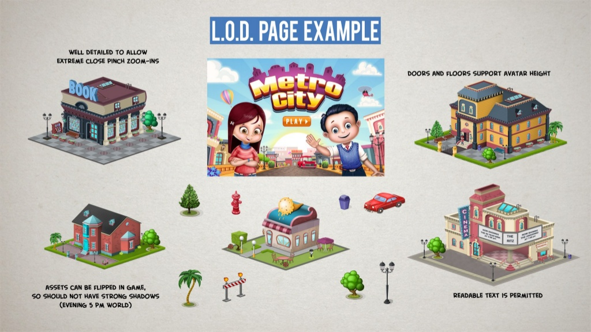

## Art Bible

You can use the [editor on GitHub](https://github.com/AlexLA99/Art-Bible/edit/master/README.md) to maintain and preview the content for your website in Markdown files.

I am [Alex López](https://github.com/AlexLA99), student of the [Bachelor’s Degree in Video Games by UPC at CITM](https://www.citm.upc.edu/ing/estudis/graus-videojocs/). This content is generated for the second year’s subject Project 2, under supervision of lecturer [Ramon Santamaria](https://github.com/raysan5).

### What is an Art Bible?

An Art Bible is a document created to communicate to the art team exactly what style the art assets should match. In other words, is a document that describes the style of the game. This document helps to avoid mixing different styles of art and helps the artist know which direction the art takes and makes everybody follow an established line.

### Functionality

**Maintain consistency**

**Show how the game will look**

**Help new workers join the proyect**

**Help the art team understand the direction of artand the decisions done**

**Help in marketing**

### Points it must consider

**Who is the target of the game?**

**All artists have to understand art so that they work in the same style even the newcomers**

**It will be used?**

**Is the investor able to understand the decisions of the art department?**

### When is the moment?

The ideal moment is just after the GDD, before starting the production of the game. Doing so will save a lot of time unnecessary assets and wasted effort.

### Things that should be included

**Art Style**

It is going to be a game with realistic aesthetics or it will be more cartoonish? What are the pproportion of the buildings and the characters?


**Character Art**

The characters must be created according to the style defined, and should be differenciable from the other games.The main points are: posing, expressions, colour palette, height scale comparison, costume, and style and construction.




**Level of detail**

Decide in which things more effort will be spent and in which ones is better to have low quality. The level of detail in a cinematic, the character when is far from the camera, when it is near, the buildings... This will save resources, time and effort.




**Camera**


```markdown
Syntax highlighted code block

# Header 1
## Header 2
### Header 3

- Bulleted
- List

1. Numbered
2. List

**Bold** and _Italic_ and `Code` text

[Link](url) and 
```

For more details see [GitHub Flavored Markdown](https://guides.github.com/features/mastering-markdown/).

### Jekyll Themes

Your Pages site will use the layout and styles from the Jekyll theme you have selected in your [repository settings](https://github.com/AlexLA99/Art-Bible/settings). The name of this theme is saved in the Jekyll `_config.yml` configuration file.

### Support or Contact

Having trouble with Pages? Check out our [documentation](https://help.github.com/categories/github-pages-basics/) or [contact support](https://github.com/contact) and we’ll help you sort it out.
