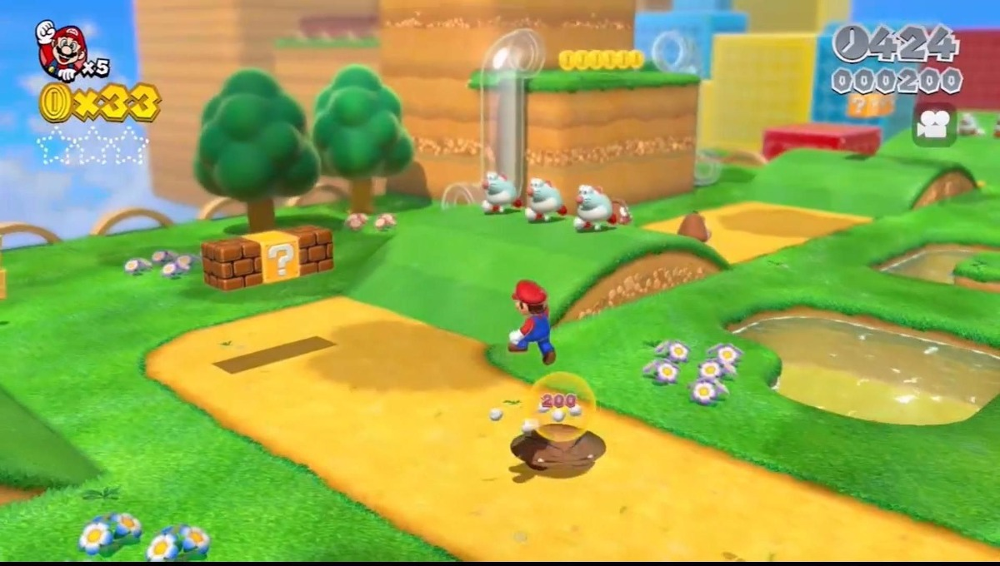
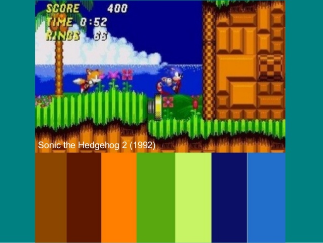
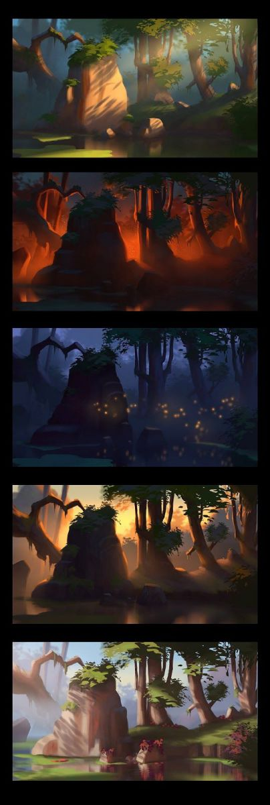
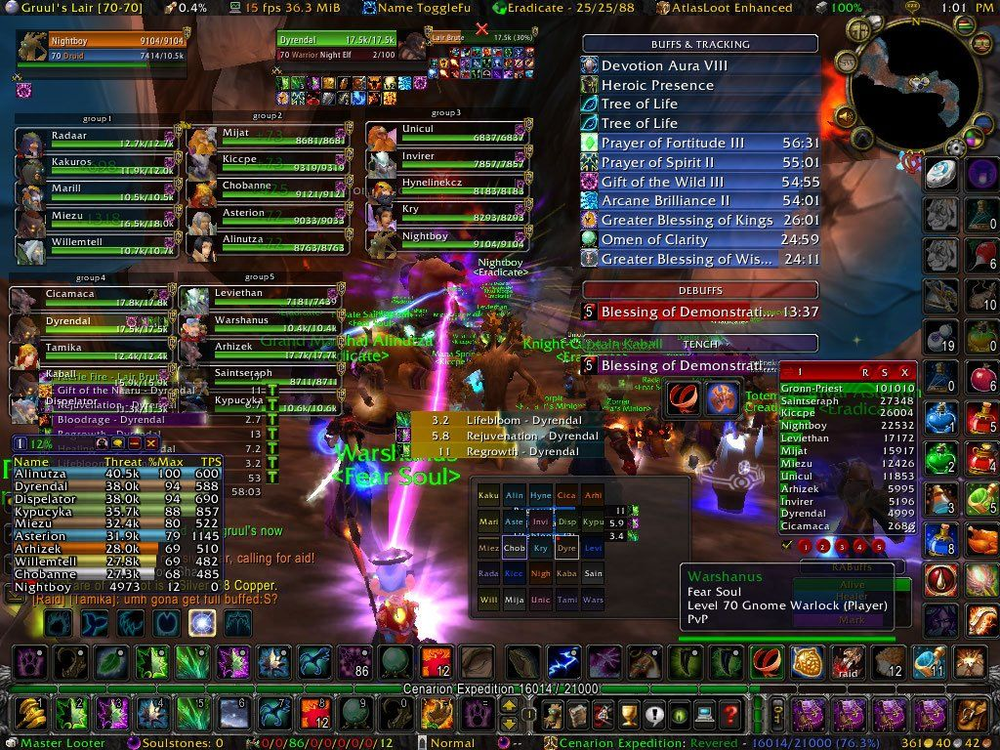
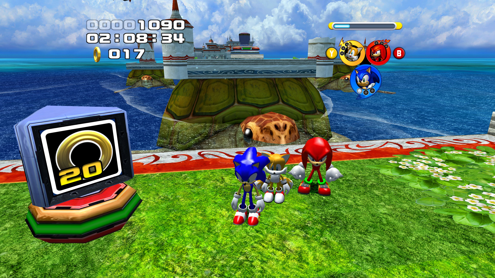
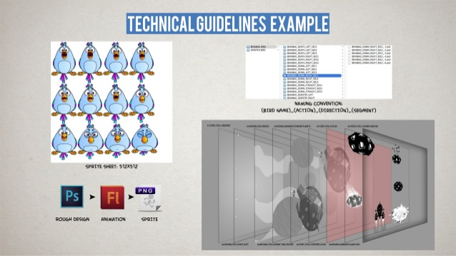
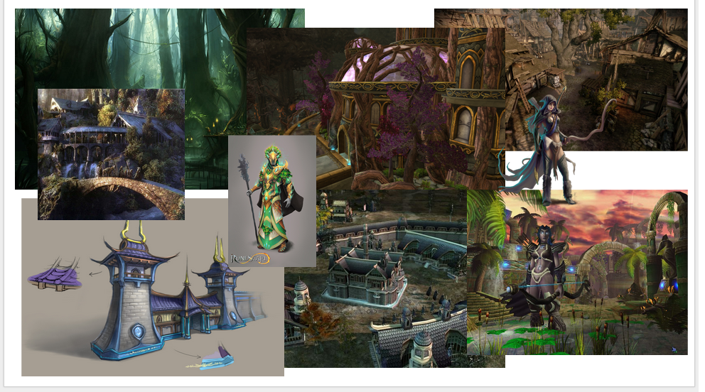

## Art Bible

I am [Alex López](https://github.com/AlexLA99), student of the [Bachelor’s Degree in Video Games by UPC at CITM](https://www.citm.upc.edu/ing/estudis/graus-videojocs/). This content is generated for the second year’s subject Project 2, under supervision of lecturer [Ramon Santamaria](https://github.com/raysan5).

### 1. What is an Art Bible?

An Art Bible is a document created to communicate to the art team exactly what style the art assets should match. In other words, is a document that describes the style of the game. This document helps to avoid mixing different styles of art and helps the artist know which direction the art takes and makes everybody follow an established line.

### 2. Functionality

**Maintain consistency**

**Show how the game will look**

**Help new workers join the proyect**

**Help the art team understand the direction of artand the decisions done**

**Help in marketing**

### 3. Points it must consider

**Who is the target of the game?**

**All artists have to understand art so that they work in the same style even the newcomers**

**It will be used?**

**Is the investor able to understand the decisions of the art department?**

### 4. When is the moment?

The ideal moment is just after the GDD, before starting the production of the game. Doing so will save a lot of time unnecessary assets and wasted effort.

### 5. Things that should be included

**1- Art Style**

It is going to be a game with realistic aesthetics or it will be more cartoonish? What are the pproportion of the buildings and the characters?

**2- Character Art**

The characters must be created according to the style defined, and should be differenciable from the other games.The main points are: posing, expressions, colour palette, height scale comparison, costume, and style and construction.

**3- Level of detail**

Decide in which things more effort will be spent and in which ones is better to have low quality. The level of detail in a cinematic, the character when is far from the camera, when it is near, the buildings... This will save resources, time and effort.

**4- Camera**

The camera has to be clearly defined, the angle, field of view, the person and the position. It helps a lot to determine the postion of props and characters. Depending on the camera the level of inmersion will be different and it can express different emotions.

**5- Color Palette**

This is one of the most essential parts of the document. Here you  have to talk about colour saturation, swatches, tones, hues, and why have been choosen. They help to differentiate the sceenes, objects, characters, backgrounds, etc. Also they express emotions, and abstract things like danger.

**6- Atmosphere**

Here you have to define the day, night and all the weather. Also define the emotions that provoque the scenes and colours.

**7- User Interface**

The UI is an aspect that can change de game a lot, from a good one to a horrible one. Here you have to define how complex will be the UI and where the elements will be placed.

**8- Technical Guidelines**

Here you have to define the format of the files, the nomenclature and which programs will be used for each task.

**9- References**

In addition to all references you have shown in the previous points, you can add a references sections where you can show some photos showing more or less the general idea of the game.

### 6. Example

[Dota2 - Character Art Guide](http://wiki.polycount.com/w/images/1/1f/Dota2CharacterArtGuide.pdf)

### 7. Bibliography

Art Bibles – What are They?

[https://jacobduniam.com/2017/01/03/art-bibles-what-are-they/](https://jacobduniam.com/2017/01/03/art-bibles-what-are-they/)

Color in games: An in-depth look at one of game design's most useful tools

[https://www.gamasutra.com/blogs/HermanTulleken/20150729/249761/Color_in_Games.php](https://www.gamasutra.com/blogs/HermanTulleken/20150729/249761/Color_in_Games.php)

Dota2 - Character Art Guide

[http://wiki.polycount.com/w/images/1/1f/Dota2CharacterArtGuide.pdf](http://wiki.polycount.com/w/images/1/1f/Dota2CharacterArtGuide.pdf)
